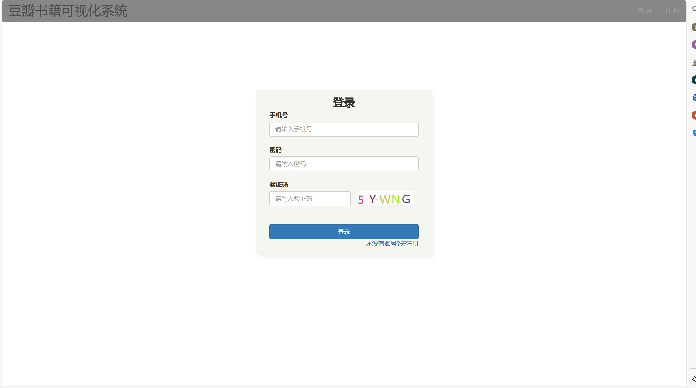
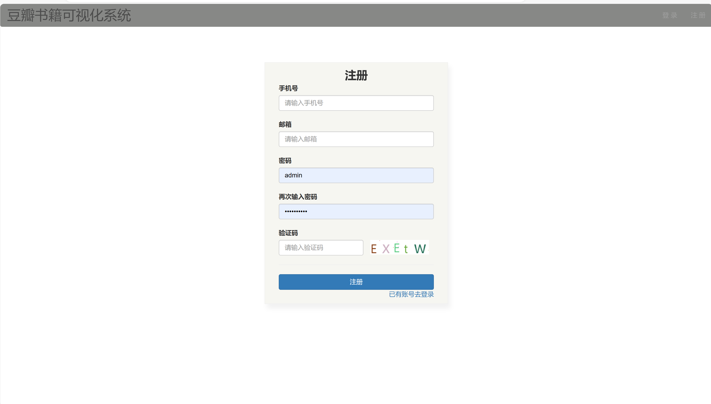
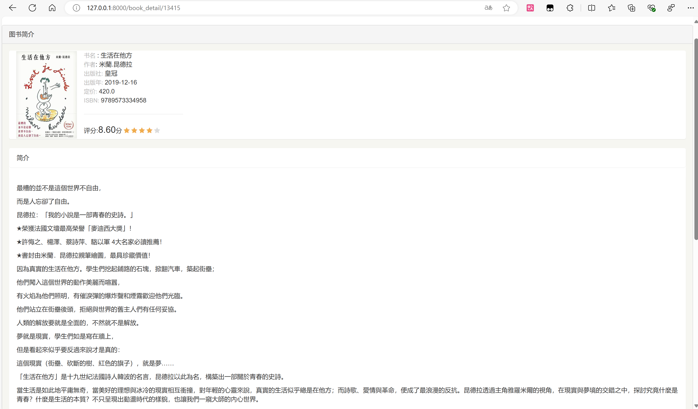
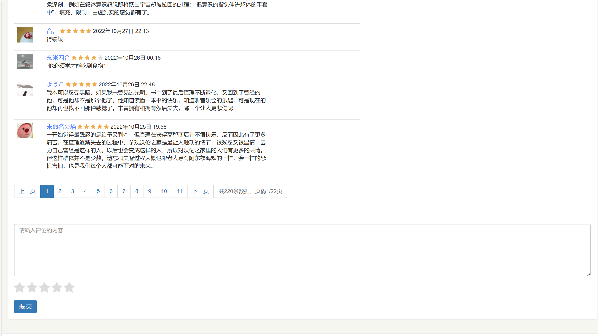
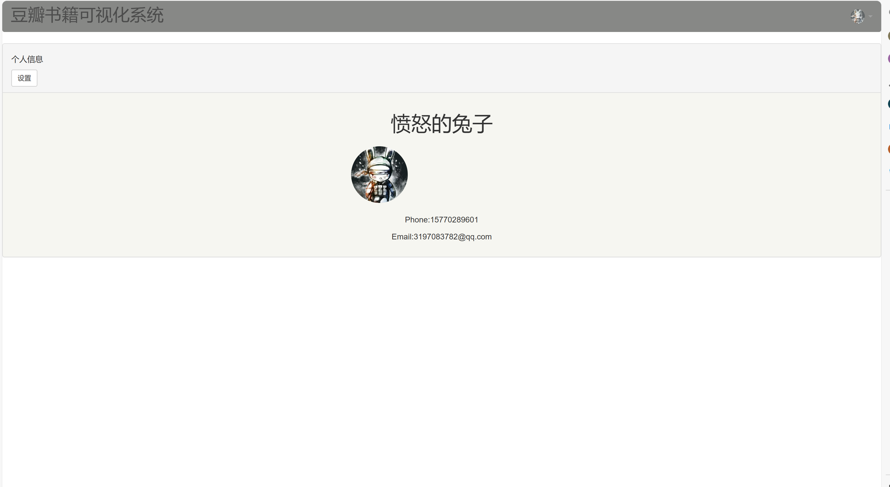
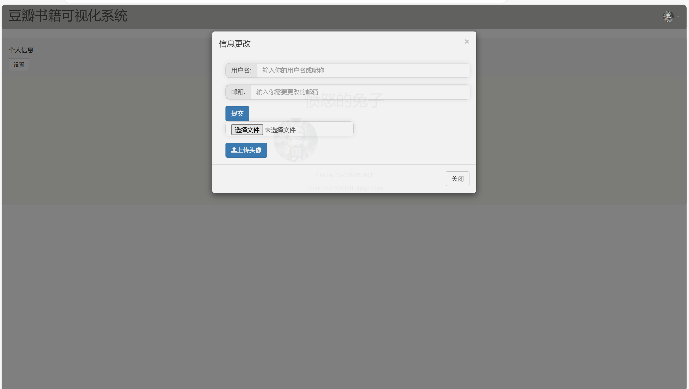
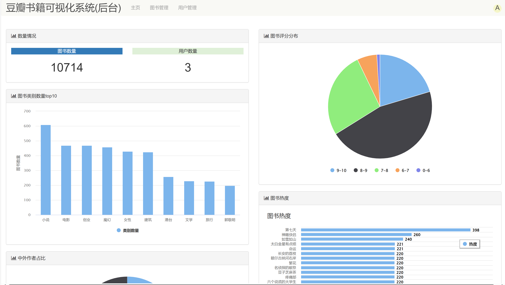
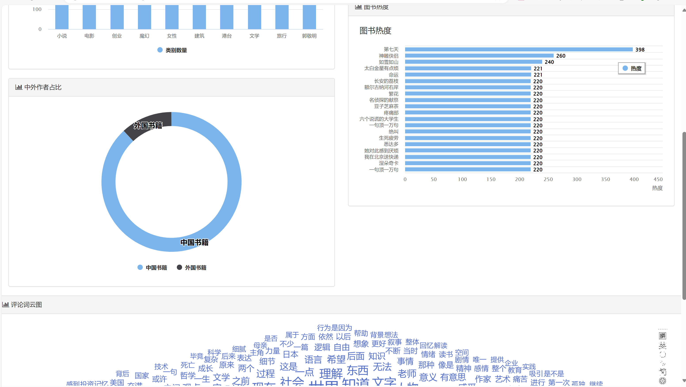
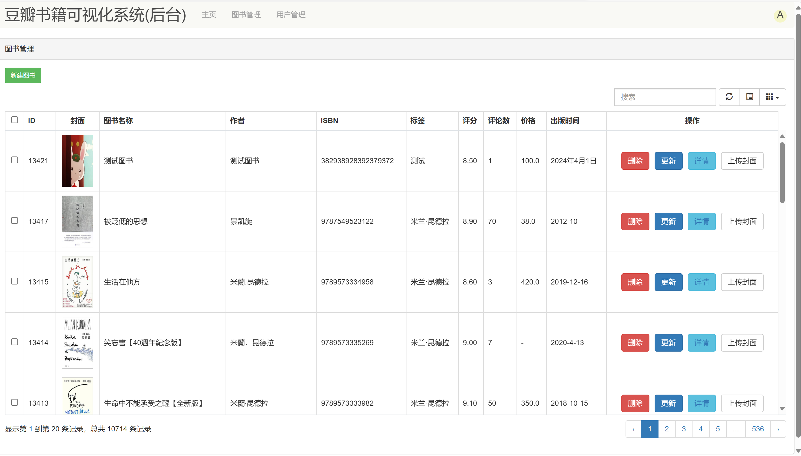
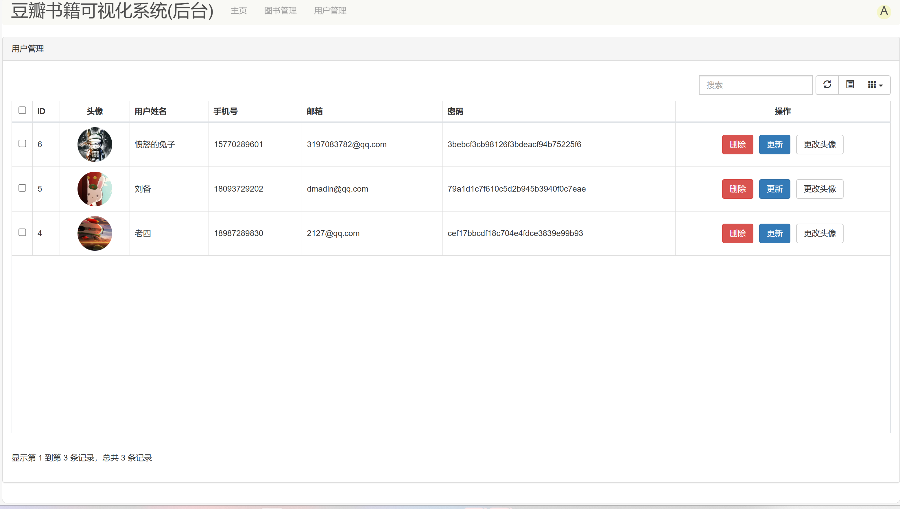

# django豆瓣图书可视化管理系统
> 基于django豆瓣图书可视化管理系统，具有搜索，查看，分类，评论，评分后台图书管理，可视化等功能,

## 部分项目简单展示

### 前台









###




## 运行
1.下载项目
```shell
git clone https://github.com/duanguolei/doubanbook.git
```

2.下载依赖
```shell
cd doubanbook
```
```shell
pip install -r requirements.txt
```

3.配置环境

> 并配置mysql,redis

4.迁移数据库
```shell
python manage.py makemigrations

python manage.py migrate
```

5.运行
```shell
python manage.py runserver
```
- 前台访问:http://127.0.0.1:8000
- 后台访问:
```shell
python book/scripts/init_manage_user.py
```
http://127.0.0.1:8000/manage
账户密码: admin 123456


- __代码中存在一定逻辑漏洞，不完善之处，欢迎点评指正__
- __如果代码对你有帮助，麻烦给个免费的star__
